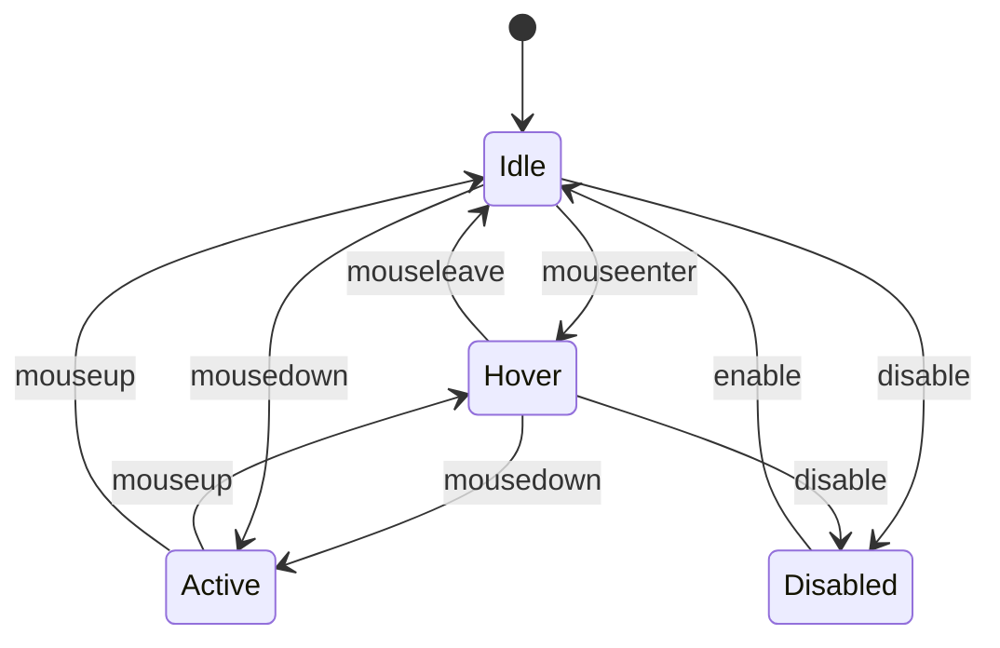

# Translation Memo: Component Contract Template

Status: draft
Created: 2026-03-11
Updated: 2026-03-11
Target: g01.004

## Summary

Flint will use a contract-first approach with standardized documentation templates. Contracts will define semantic behavior, accessibility, and parity requirements that both Svelte and GPUI implementations must satisfy. Each contract includes explicit parity checklists and documented deltas.

---

## Sources

| Source | Link | Relevant Findings |
|--------|------|-------------------|
| React Aria | https://react-aria.adobe.com/ | Three-layer architecture, contract structure |
| Zag.js | https://zagjs.com/ | State machine contracts, framework adapters |
| tk-cross-framework-contracts | [../value-tracks/tk-cross-framework-contracts.md](../value-tracks/tk-cross-framework-contracts.md) | Contract pattern research |

---

## Decisions

### 1. Contract-First Development

**Decision:** All Flint components must have an approved contract document before implementation begins.

**Rationale:**
- Ensures both Svelte and GPUI implement same semantics
- Prevents implementation drift
- Provides single source of truth for component behavior
- Enables parallel implementation (Svelte and GPUI teams can work from same spec)

**Workflow:**
1. Write contract document
2. Review and approve
3. Implement in Svelte
4. Implement in GPUI
5. Verify parity checklist
6. Document any discovered deltas

**Implications:**
- Slower initial component creation
- Higher consistency
- Reduced rework

### 2. Contract Template Structure

**Decision:** Use standardized 11-section template for all component contracts.

**Template Sections:**

| # | Section | Purpose | Required |
|---|---------|---------|----------|
| 1 | Purpose | What the component does | ✅ |
| 2 | Anatomy | Structural parts | ✅ |
| 3 | Props/Inputs | Configuration options | ✅ |
| 4 | States | Visual and component states | ✅ |
| 5 | Events | Callbacks and timing | ✅ |
| 6 | Accessibility | ARIA, keyboard, screen reader | ✅ |
| 7 | Layout | Sizing, spacing, positioning | ✅ |
| 8 | Token Usage | Which tokens apply where | ✅ |
| 9 | Svelte Notes | Implementation specifics | ✅ |
| 10 | GPUI Notes | Implementation specifics | ✅ |
| 11 | Parity Checklist | Verification list | ✅ |
| 12 | Known Deltas | Intentional differences | If any |

**Rationale:**
- React Aria and Zag.js both use comprehensive documentation
- Ensures no critical aspect is forgotten
- Provides clear structure for authors

**Implications:**
- Contract documents will be lengthy but thorough
- Template enforcement via PR review

### 3. Props API Design Principles

**Decision:** Props follow these design principles across all components.

**Naming:**
- Use camelCase for multi-word props
- Boolean props: `isDisabled`, `isLoading` (not `disabled`, `loading`)
  - Rationale: Clear distinction from HTML attributes
- Event handlers: `onClick`, `onFocus`, `onChange` (not `handleClick`)

**State Handling:**
- Support both controlled and uncontrolled patterns
- Controlled: `value` + `onChange`
- Uncontrolled: `defaultValue`

**Variants:**
- `variant` for visual style (primary, secondary, ghost)
- `size` for control size (sm, md, lg)
- Use enums with specific values (not free strings)

**Accessibility:**
- `aria-label` for icon-only buttons
- `aria-describedby` for error messages
- Never make accessibility optional when required

**Rationale:**
- Consistency across Flint component suite
- React Aria patterns proven in production
- Clear semantics for both Svelte and GPUI

### 4. Three-Tier Parity Model

**Decision:** Define three levels of parity with different strictness.

**Tier 1: Strict Parity (Must Match)**
- Semantic behavior
- State transitions
- Event timing
- Accessibility (ARIA roles, keyboard behavior)
- Form integration (if applicable)

**Tier 2: Visual Parity (Should Match)**
- Colors (from tokens)
- Spacing (from tokens)
- Typography (from tokens)
- Overall proportions

**Tier 3: Implementation Freedom (Can Differ)**
- Internal state management
- Event handling details
- Rendering approach
- Animation mechanism
- CSS vs GPUI styling internals

**Rationale:**
- Acknowledges platform differences
- Ensures user-facing consistency
- Allows idiomatic implementation in each framework

**Implications:**
- Contract template needs parity checklist section
- Deltas must be explicitly documented
- Tests focus on Tier 1 parity

### 5. Anatomy Documentation

**Decision:** All components document their structural anatomy.

**Format:**
```markdown
## Anatomy

```
[Root]
  ├── [Label]
  ├── [Icon] (optional)
  ├── [Content]
  └── [Trailing Icon] (optional)
```

| Part | Description | Token Target |
|------|-------------|--------------|
| Root | Container element | background, border |
| Label | Text content | text-primary |
| Icon | Leading icon | text-secondary |
```

**Rationale:**
- React Aria and Zag.js both use anatomy diagrams
- Critical for accessibility (which part has which ARIA role)
- Guides styling decisions

**Implications:**
- Visual diagrams helpful but not required
- Must identify which tokens apply to which parts

### 6. State Documentation

**Decision:** Document both visual states and component states.

**Visual States:**
- Default
- Hover (mouse over)
- Focus (keyboard focused)
- Active/Pressed (being activated)
- Disabled
- Loading
- Error (for inputs)

**Component States (for complex components):**
- State machine diagram (Mermaid)
- State transition table

**Example:**
```markdown
## States

### Visual States

| State | Trigger | Visual Change |
|-------|---------|---------------|
| Hover | `onMouseEnter` | Background darkens 5% |
| Focus | `onFocus` | Ring appears |
| Active | `onMouseDown` | Scale 0.98 |
| Disabled | `isDisabled={true}` | Opacity 0.5, no hover |

### State Machine


```

**Rationale:**
- Zag.js uses state machines effectively
- Clarifies behavior for implementers
- Ensures both platforms implement same transitions

### 7. Accessibility Requirements

**Decision:** Every contract includes mandatory accessibility section.

**Required Contents:**
- ARIA role
- Required ARIA attributes
- Optional ARIA attributes
- Keyboard interaction table
- Focus behavior
- Screen reader announcements (for dynamic content)

**Example:**
```markdown
## Accessibility

### ARIA

- **Role**: `button`
- **Required**: 
  - `aria-label` (when no visible text)
  - `aria-expanded` (when controlling popup)
  - `aria-haspopup` (when controlling popup)
- **Optional**:
  - `aria-describedby` (for additional context)
  - `aria-pressed` (for toggle buttons)

### Keyboard

| Key | Action |
|-----|--------|
| Enter/Space | Activate button |
| Tab | Move focus to/from button |

### Focus

- Focus visible on keyboard navigation
- Focus ring uses `semantic.color.focus` token
- No focus ring on mouse click (Svelte: `:focus-visible`, GPUI: native)
```

**Rationale:**
- React Aria prioritizes accessibility
- Flint's goal includes "same accessibility guarantees"
- Legal/regulatory requirements increasingly strict

**Implications:**
- Accessibility review required for all contracts
- g02.011 accessibility hardening milestone

### 8. Token Usage Mapping

**Decision:** Each contract documents which semantic tokens apply to which parts.

**Format:**
```markdown
## Token Usage

| Part | Token | Fallback |
|------|-------|----------|
| Background (default) | `semantic.color.background.primary` | white |
| Background (hover) | `semantic.color.background.hover` | 5% darken |
| Text | `semantic.color.text.primary` | black |
| Border | `semantic.color.border.default` | transparent |
| Border (focus) | `semantic.color.focus` | blue |

### Mode Variants

| Mode | Background | Text |
|------|------------|------|
| Light | `background.primary` | `text.primary` |
| Dark | `background.primary` (dark) | `text.primary` (light) |
```

**Rationale:**
- Ensures consistent token application
- Documents theming behavior
- Reference for implementers

### 9. Implementation Notes Structure

**Decision:** Implementation notes are organized by framework.

**Svelte Notes Include:**
- Bits usage (if applicable)
- Svelte-specific patterns (actions, transitions)
- Event handling specifics
- Known limitations

**GPUI Notes Include:**
- GPUI patterns used (IntoElement, Model)
- State management approach
- Event handling specifics
- Known limitations

**Example:**
```markdown
## Implementation Notes

### Svelte

- Uses `bits-ui` Button primitive
- Adds Flint-specific styling via CSS custom properties
- Transition on background-color for hover state

### GPUI

- Implements `IntoElement` trait
- State via `ButtonState` model with `is_loading`, `is_disabled`
- Uses GPUI's built-in hover/active detection
- No custom animations (uses GPUI defaults)
```

### 10. Parity Checklist

**Decision:** Every contract includes verification checklist.

**Standard Checklist:**
```markdown
## Parity Checklist

- [ ] Same props have same semantic effect
- [ ] Same visual states exist
- [ ] Same component states exist (if applicable)
- [ ] Same events fire at same times
- [ ] Same event payloads (where applicable)
- [ ] Same keyboard navigation
- [ ] Same ARIA roles
- [ ] Same ARIA attributes
- [ ] Same focus behavior
- [ ] Same layout behavior (sizing, positioning)
- [ ] Same token usage
```

**Rationale:**
- Explicit verification of parity
- QA/testing reference
- Documentation of what "parity" means for this component

### 11. Known Deltas Documentation

**Decision:** Intentional differences must be explicitly documented.

**Format:**
```markdown
## Known Deltas

| Aspect | Svelte | GPUI | Rationale |
|--------|--------|------|-----------|
| Focus ring | CSS `outline` with `outline-offset` | GPUI native focus | Platform convention |
| Hover animation | CSS transition 150ms | GPUI default | Implementation detail |
| Click handling | DOM `click` event | GPUI `ClickEvent` | Framework difference |
| Disabled state | `disabled` attribute | Visual only + event blocking | GPUI has no native disabled |
```

**Rationale:**
- Transparency about differences
- Documents why differences exist
- Reference for consumers

---

## Action Items

- [ ] Create contract template file in `docs/templates/component-contract.md`
- [ ] Create example contract for Button component
- [ ] Document contract-first workflow in architecture
- [ ] Add contract review to PR checklist
- [ ] Update g01.004 milestone with contract deliverables

---

## Related

- Value track: [tk-cross-framework-contracts](../value-tracks/tk-cross-framework-contracts.md)
- Source hub: [hub-gpui](../source-hubs/hub-gpui.md)
- Source hub: [hub-bits](../source-hubs/hub-bits.md)
- Milestone: [g01.004](../../roadmaps/g01/004-component-contract-template-and-documentation-ia.md)
